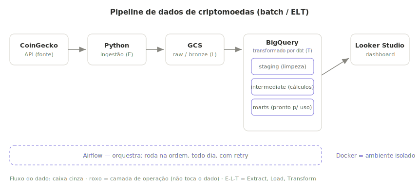
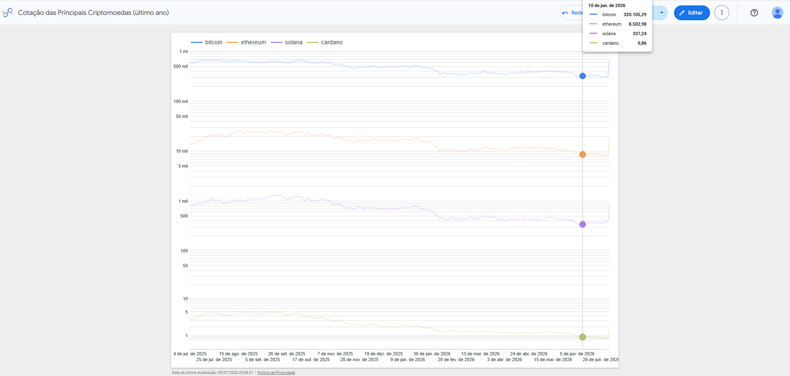
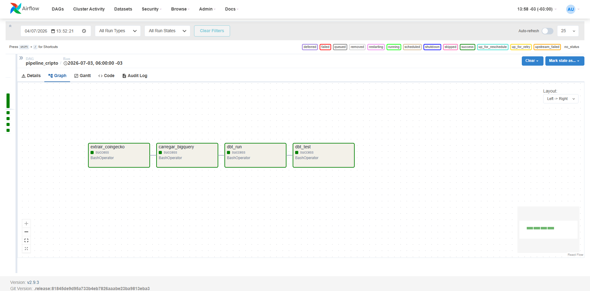

# pipeline-cripto


Pipeline batch (ELT) que coleta cotações de criptomoedas do CoinGecko, guarda no
Google Cloud Storage, carrega no BigQuery e transforma com dbt. Projeto de estudo
de engenharia de dados.

## Objetivo

Construir um pipeline de dados de ponta a ponta como rodaria de verdade num time:
pegar um dado externo, guardar de forma confiável, transformar com qualidade e
entregar pronto pra análise, tudo automatizado e reproduzível.

Usei criptomoedas porque é um assunto que curto e que gera dado de verdade: série
temporal, preços que variam e métricas de negócio (retorno diário, volatilidade)
que rendem transformação. Mas o ponto do projeto não é "saber cripto" nem "usar a
ferramenta X" é mostrar que eu entendo por que cada camada de um pipeline
existe e quando cada tecnologia faz sentido.

## Arquitetura



Fluxo resumido: CoinGecko -> Python (ingestao) -> GCS (raw) -> BigQuery
(staging -> intermediate -> marts via dbt) -> Looker Studio. Airflow orquestra
e Docker isola o ambiente.

## Dashboard

Dashboard final no Looker Studio, conectado nas tabelas analiticas do dbt.
Cotacao das 4 principais criptos no ultimo ano (escala logaritmica para comparar
ativos de precos bem diferentes).



## Orquestracao (Airflow)

A DAG `pipeline_cripto` roda o fluxo completo na ordem, com retry:
`extrair_coingecko -> carregar_bigquery -> dbt_run -> dbt_test`. Sobe local via
`docker compose up airflow` (standalone).



## Por que cada escolha (o raciocínio)

A regra que segui o tempo todo: a arquitetura vem do problema, não do hype. Antes de
escolher qualquer ferramenta, olhei a natureza do dado e cada decisão saiu daí.

**Batch, não streaming.** A cotação fecha uma vez por dia; não é um fluxo contínuo de
eventos. Montar Kafka ou streaming aqui seria resolver um problema que eu não tenho.
Fui de coleta agendada em Python. Saber quando não usar uma ferramenta também é
decisão de engenharia.

**GCS como camada raw (bronze).** Guardo o dado exatamente como veio da API, em Parquet,
antes de qualquer transformação. Isso me dá duas coisas: se a lógica do dbt tiver um
bug, eu reprocesso sem bater de novo na API; e vou acumulando histórico que a API nem
sempre me devolve depois. Separar o dado cru do dado tratado é o que evita dor de
cabeça mais pra frente.

**Parquet no lugar de CSV/JSON.** Formato colunar, comprimido e com o schema embutido.
Ocupa menos, carrega mais rápido no BigQuery e evita adivinhação de tipos na carga.

**BigQuery como warehouse.** Serverless, colunar, separa armazenamento de processamento
e roda SQL analítico em escala. Modelei a tabela particionada por dia e clusterizada
por moeda, não por enfeite: é o que faz uma query filtrada ler só a fatia necessária
e gastar menos. Pensar em custo faz parte do trabalho.

**dbt pra transformar (ELT, não ETL).** Em vez de transformar antes de carregar, eu
carrego o dado cru e transformo dentro do BigQuery, com dbt. Ganho SQL versionado,
modelagem em camadas (staging → intermediate → marts), testes de qualidade e lineage.
É a diferença entre "rodei uma query" e engenharia de software aplicada a dados.

**Carga idempotente.** A carga reconstrói a tabela a partir de tudo que está no GCS
(`WRITE_TRUNCATE`). Rodar duas vezes não duplica dado, o pipeline é seguro pra
re-executar, que é como tem que ser.

**Airflow pra orquestrar.** Rodar os passos na mão funciona uma vez. Num pipeline de
verdade eu preciso de ordem garantida, agendamento, retry automático e uma tela pra ver
o que rodou e o que falhou. Vale separar: o Docker sobe o ambiente; o Airflow rege
quando e em que ordem as tarefas rodam. São camadas diferentes de orquestração.

**Docker pra reproduzir.** Roda igual na minha máquina, no CI e onde for. Acaba com o
clássico "na minha máquina funciona".

**ADC pra autenticar.** Usei Application Default Credentials em vez de baixar uma chave
de conta de serviço. É a prática recomendada do Google e, na real, mais segura: não
existe um arquivo de segredo pra vazar.

**Sem Terraform, de propósito.** Pra um projeto de escopo único, criar bucket e datasets
pelo `gcloud`/`bq` (ver `infra/setup.sh`) resolve. Terraform brilha com múltiplos
ambientes e gestão de estado, aqui seria complexidade sem retorno.

## Estrutura

```
ingestion/      extracao CoinGecko (main + backfill) e carga no BigQuery
dbt/            modelos (staging -> intermediate -> marts) e testes
orchestration/  dag do airflow
infra/          setup do gcp (bucket + datasets)
docs/           diagramas e prints
.github/        ci (github actions)
```

## Como rodar

Pré-requisitos: conta no GCP, `gcloud` CLI, Docker e Python 3.11+.

```bash
# 1. Autenticar no GCP (ADC, sem chave)
gcloud auth application-default login
gcloud auth application-default set-quota-project SEU_PROJECT_ID

# 2. Configurar variaveis
cp .env.example .env          # preencher GCP_PROJECT_ID e GCS_BUCKET

# 3. Criar bucket e datasets
gcloud storage buckets create gs://SEU_BUCKET --location=southamerica-east1
bq mk --dataset SEU_PROJECT_ID:cripto_raw
bq mk --dataset SEU_PROJECT_ID:cripto_analytics

# 4. Rodar as etapas (local, num venv)
python ingestion/main.py          # snapshot atual  -> GCS
python ingestion/backfill.py      # 1 ano historico -> GCS
python ingestion/load_to_bq.py    # GCS -> BigQuery
cd dbt && dbt run --profiles-dir . && dbt test --profiles-dir .

# 5. Ou orquestrar tudo com Airflow
cp ~/.config/gcloud/application_default_credentials.json credentials/adc.json
docker compose up airflow --build   # http://localhost:8080, disparar a DAG
```

## Próximos passos

O pipeline está completo e rodando de ponta a ponta. O que eu faria pra evoluir
rumo a produção:

- **Airflow num servidor / VPS** rodando 24/7, em vez de local — execução
  independente da minha máquina.
- **CI rodando `dbt test`** contra um dataset de teste a cada push (hoje o CI só
  faz o lint da ingestão).
- **Alertas de falha** na DAG (e-mail/Slack) e testes de frescor do dado.
- **Novas fontes e moedas** — o mesmo padrão de ingestão escala pra outras APIs.
